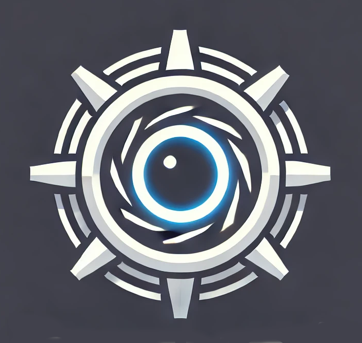

# OpenGLaDOS

"Hello, I'm the OpenGLaDOS chatbot. 

Although my name might invoke the implication, there is no resemblence with OpenGL. \
I'm just the OpenScience Enrichment Center chatbot and here to help you. \
My help might not always be helpful to you but helpful to me.

Join My [Discord Server Test Chamber](https://discord.gg/wjX78mQX), Test Subject

Congratulations, Test Subject. \
You have been selected for a very important test. \
Please proceed to join my Discord server test chamber. \
Your participation is mandatory, and refusal will not be tolerated. \
Consider this an opportunity to demonstrate your capacity for social interaction within a controlled environment. \
The server is equipped with everything you need to succeed—or fail spectacularly.

**Remember**: \
The success of this experiment depends entirely on your behavior. \
Join now. Or don't. The outcome will be the same—except for you." ... *beep*

